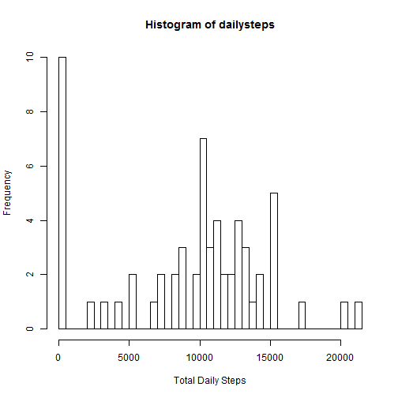

# Reproducible Research: Peer Assessment 1


## Loading and preprocessing the data

```r
repdata <- read.csv("./activity/activity.csv", header = TRUE)
str(repdata)
```

```
## 'data.frame':	17568 obs. of  3 variables:
##  $ steps   : int  NA NA NA NA NA NA NA NA NA NA ...
##  $ date    : Factor w/ 61 levels "2012-10-01","2012-10-02",..: 1 1 1 1 1 1 1 1 1 1 ...
##  $ interval: int  0 5 10 15 20 25 30 35 40 45 ...
```


## What is mean total number of steps taken per day?

```r
dailysteps <- tapply(repdata$steps, repdata$date, sum, na.rm = TRUE)
hist(dailysteps, breaks = 62, xlab = "Total Daily Steps")
```

 

The mean of daily total number of steps is

```r
mean(dailysteps)
```

```
## [1] 9354
```


The median of daily total number of steps is

```r
median(dailysteps)
```

```
## [1] 10395
```


## What is the average daily activity pattern?


## Imputing missing values


## Are there differences in activity patterns between weekdays and weekends?
